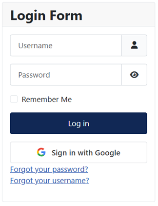
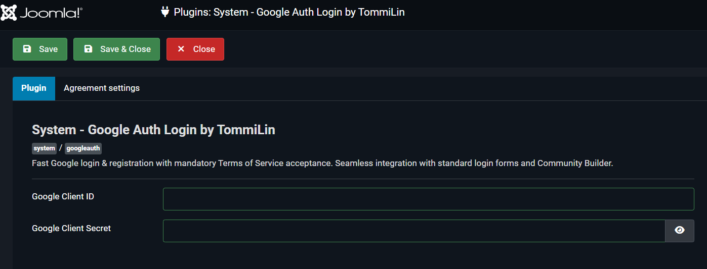

# Joomla Google Authentication System Plugin

A Joomla system plugin for user authentication and registration via **Google OAuth 2.0 / OpenID Connect**. The plugin automatically integrates with the standard Joomla login form and **Community Builder (CB)**, providing seamless login, profile synchronization, and avatar uploads in the native CB style.

---
## Visual Presentation

### 1. Frontend Module View
This is what a standard authentication form button looks like:

### 3. Core Administrative Control Panel

## Key Features

* **Login Form Integration**: Automatically adds a branded "Sign in with Google" button to login pages (supports standard modules and Community Builder forms).
* **Community Builder Synchronization**: 
  * Automatically creates a record in the `#__comprofiler` table upon the first login.
  * Automatically populates the first and last name from the Google profile.
  * Sets confirmation (`confirmed = 1`) and approval (`approved = 1`) flags.
* **Avatar Upload**: Downloads the user's avatar from Google, creates a thumbnail (`tn...`), and saves it to the `/images/comprofiler/` directory using the standard CB naming format (`{user_id}_{hash}.jpg`).
* **Consent Screen**: A customizable terms of service and privacy policy consent screen for new or previously unlinked accounts.
* **Security**: CSRF protection via the `state` parameter, OpenID Connect token validation, and secure password hashing for newly created accounts.

---

## Security Details

* **CSRF Protection via the `state` Parameter**: 
  * **The Threat**: Without CSRF protection, an attacker could intercept the authentication flow or trick a user into linking an unauthorized Google account to an unintended Joomla profile.
  * **Implementation**: Before redirecting the user to Google, the plugin generates a cryptographically secure random string using `random_bytes(32)` and stores it in the Joomla session (`self::STATE_KEY`). When Google redirects the user back (`handleGoogleCallback`), the plugin validates the returned `state` against the session value using timing-attack safe `hash_equals`.
* **OpenID Connect Token Validation**: 
  * **The Threat**: Relying solely on raw GET parameters from the callback URL leaves the system vulnerable to profile spoofing or fake tokens.
  * **Implementation**: The plugin securely exchanges the authorization `code` via a server-to-server POST request to Google's token endpoint (`https://oauth2.googleapis.com/token`) to obtain a valid `access_token`. It then requests user profile data directly from the trusted OpenID Connect endpoint (`https://openidconnect.googleapis.com/v1/userinfo`) using the bearer token, validating HTTP statuses and structured responses.
* **Secure Password Hashing for New Accounts**: 
  * **The Threat**: Joomla's `#__users` table requires a non-empty password hash field. Leaving newly created social login accounts without proper hashing or weak passwords can compromise security.
  * **Implementation**: When creating a user via Google OAuth, the plugin generates a random cryptographic string and passes it through Joomla's native user helper (`UserHelper::hashPassword`) to establish a strong, unbreakable password hash (Bcrypt/Argon2), effectively locking the account against standard password-based brute force attacks while allowing token-based logins.

---

## Requirements

* Joomla **4.x** / **5.x** / **6.x** (Ready)
* PHP **8.1** or higher
* **Community Builder** component (optional, auto-detected)

---

## Installation and Setup

1. Install the plugin package via the standard Joomla extension manager (`System` -> `Install`).
2. Go to the **Plugin Manager**, find **System - Google Auth**, and open its settings.
3. Enter your **Client ID** and **Client Secret** obtained from the Google Cloud Console.
4. Set the valid **Redirect URI** in your Google Cloud project settings to match the plugin's callback URL:
   `https://your-site.com/index.php?option=com_ajax&plugin=googleauth&group=system&format=raw`
5. Configure the consent screen options, privacy policy links, and user creation rules.
6. Enable the plugin (**Status: Enabled**).
